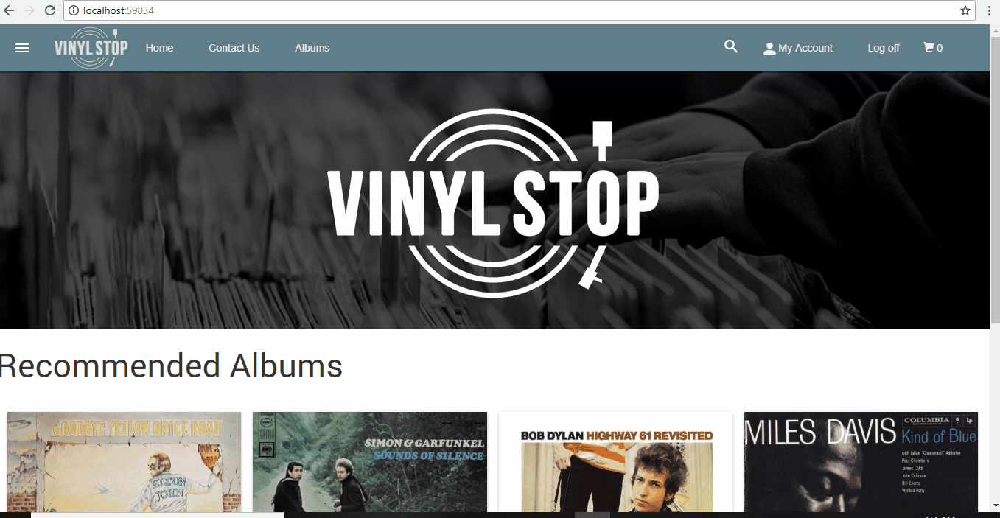

# Vinyl-Stop
Simple eCommerce web app for a fictional vinyl record store

### Short Demo




### Get the Code

Either clone this repository or fork it on GitHub and clone your fork:

```
https://github.com/davidm5963/Vinyl-Stop.git
cd Vinyl-Stop
```


## Built With

* C#
* ASP.NET Core MVC
* EntityFramework Core
* Material Design Lite

## Software Requirements To Run Locally

* Visual Studio 2017 Community (or higher) for Windows. Any editor on Mac.
* ASP.NET Core SDK 2.0 or higher - http://dot.net 

### Running the Application Locally on Windows

1. Open the .sln file in Visual Studio

2. Modify the connection string in _appsettings.json_ to reflect your environment

1. Start the application (F5)

1. Browse to http://localhost:59834

## License

This project is licensed under the MIT License - see the [LICENSE](LICENSE) file for details
